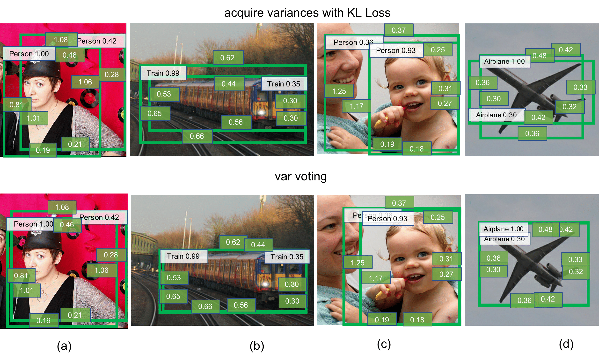

# Bounding Box Regression with Uncertainty for Accurate Object Detection
**CVPR 2019**  [[presentation (youtube)]](https://www.youtube.com/watch?v=bcGtNdTzdkc)

[Yihui He](http://yihui-he.github.io/), [Chenchen Zhu](https://sites.google.com/andrew.cmu.edu/zcckernel), [Jianren Wang](https://scholar.google.com/citations?user=NL8MDkwAAAAJ&hl=en), [Marios Savvides](http://www.cmu-biometrics.org), [Xiangyu Zhang](https://scholar.google.com/citations?user=yuB-cfoAAAAJ&hl=en&oi=ao), Carnegie Mellon University & Megvii Inc.

### Table of Contents
0. [Citation](#citation)
0. [Installation](#installation)
0. [Testing](#testing)
0. [Training](#training)
0. [PyTorch re-implementations](#pytorch-re-implementations)
0. [FAQ](#faq)

Large-scale object detection datasets (e.g., MS-COCO) try to define the ground truth bounding boxes as clear as possible. However, we observe that ambiguities are still introduced when labeling the bounding boxes. In this paper, we propose a novel bounding box regression loss for learning bounding box transformation and localization variance together. Our loss greatly improves the localization accuracies of various architectures with nearly no additional computation. The learned localization variance allows us to merge neighboring bounding boxes during non-maximum suppression (NMS), which further improves the localization performance. On MS-COCO, we boost the Average Precision (AP) of VGG-16 Faster R-CNN from 23.6% to 29.1%. More importantly, for ResNet-50-FPN Mask R-CNN, our method improves the AP and AP90 by **1.8%** and **6.2%** respectively, which significantly outperforms previous state-of-the-art bounding box refinement methods.

<div align="center">
  
</div>

### Citation
If you find the code useful in your research, please consider citing:

    @InProceedings{klloss,
      author = {He, Yihui and Zhu, Chenchen and Wang, Jianren and Savvides, Marios and Zhang, Xiangyu},
      title = {Bounding Box Regression With Uncertainty for Accurate Object Detection},
      booktitle = {The IEEE Conference on Computer Vision and Pattern Recognition (CVPR)},
      month = {June},
      year = {2019}
    }
    
### Installation  
Please find installation instructions for Caffe2 and Detectron in [`INSTALL.md`](INSTALL.md).

When installing cocoapi, please use [my fork](https://github.com/yihui-he/cocoapi) to get AP80 and AP90 scores.

### Testing
Inference without Var Voting (8 GPUs):
```
python2 tools/test_net.py -c configs/e2e_faster_rcnn_R-50-FPN_2x.yaml
```
You will get:
```
 Average Precision  (AP) @[ IoU=0.50:0.95 | area=   all | maxDets=100 ] = 0.385
 Average Precision  (AP) @[ IoU=0.50      | area=   all | maxDets=100 ] = 0.578
 Average Precision  (AP) @[ IoU=0.75      | area=   all | maxDets=100 ] = 0.412
 Average Precision  (AP) @[ IoU=0.50:0.95 | area= small | maxDets=100 ] = 0.209
 Average Precision  (AP) @[ IoU=0.50:0.95 | area=medium | maxDets=100 ] = 0.412
 Average Precision  (AP) @[ IoU=0.50:0.95 | area= large | maxDets=100 ] = 0.515
 Average Recall     (AR) @[ IoU=0.50:0.95 | area=   all | maxDets=  1 ] = 0.323
 Average Recall     (AR) @[ IoU=0.50:0.95 | area=   all | maxDets= 10 ] = 0.499
 Average Recall     (AR) @[ IoU=0.50:0.95 | area=   all | maxDets=100 ] = 0.522
 Average Recall     (AR) @[ IoU=0.50:0.95 | area= small | maxDets=100 ] = 0.321
 Average Recall     (AR) @[ IoU=0.50:0.95 | area=medium | maxDets=100 ] = 0.553
 Average Recall     (AR) @[ IoU=0.50:0.95 | area= large | maxDets=100 ] = 0.680
 Average Precision  (AP) @[ IoU=0.60      | area=   all | maxDets=100 ] = 0.533
 Average Precision  (AP) @[ IoU=0.70      | area=   all | maxDets=100 ] = 0.461
 Average Precision  (AP) @[ IoU=0.80      | area=   all | maxDets=100 ] = 0.350
 Average Precision  (AP) @[ IoU=0.85      | area=   all | maxDets=100 ] = 0.269
 Average Precision  (AP) @[ IoU=0.90      | area=   all | maxDets=100 ] = 0.154
 Average Precision  (AP) @[ IoU=0.95      | area=   all | maxDets=100 ] = 0.032
```
Inference with Var Voting:
```
python2 tools/test_net.py -c configs/e2e_faster_rcnn_R-50-FPN_2x.yaml STD_NMS True
```
You will get:
```
 Average Precision  (AP) @[ IoU=0.50:0.95 | area=   all | maxDets=100 ] = 0.392
 Average Precision  (AP) @[ IoU=0.50      | area=   all | maxDets=100 ] = 0.576
 Average Precision  (AP) @[ IoU=0.75      | area=   all | maxDets=100 ] = 0.425
 Average Precision  (AP) @[ IoU=0.50:0.95 | area= small | maxDets=100 ] = 0.212
 Average Precision  (AP) @[ IoU=0.50:0.95 | area=medium | maxDets=100 ] = 0.417
 Average Precision  (AP) @[ IoU=0.50:0.95 | area= large | maxDets=100 ] = 0.526
 Average Recall     (AR) @[ IoU=0.50:0.95 | area=   all | maxDets=  1 ] = 0.324
 Average Recall     (AR) @[ IoU=0.50:0.95 | area=   all | maxDets= 10 ] = 0.528
 Average Recall     (AR) @[ IoU=0.50:0.95 | area=   all | maxDets=100 ] = 0.564
 Average Recall     (AR) @[ IoU=0.50:0.95 | area= small | maxDets=100 ] = 0.346
 Average Recall     (AR) @[ IoU=0.50:0.95 | area=medium | maxDets=100 ] = 0.594
 Average Recall     (AR) @[ IoU=0.50:0.95 | area= large | maxDets=100 ] = 0.736
 Average Precision  (AP) @[ IoU=0.60      | area=   all | maxDets=100 ] = 0.536
 Average Precision  (AP) @[ IoU=0.70      | area=   all | maxDets=100 ] = 0.472
 Average Precision  (AP) @[ IoU=0.80      | area=   all | maxDets=100 ] = 0.363
 Average Precision  (AP) @[ IoU=0.85      | area=   all | maxDets=100 ] = 0.281
 Average Precision  (AP) @[ IoU=0.90      | area=   all | maxDets=100 ] = 0.165
 Average Precision  (AP) @[ IoU=0.95      | area=   all | maxDets=100 ] = 0.037
```

### Training
```
python2 tools/train_net.py -c configs/e2e_faster_rcnn_R-50-FPN_2x.yaml
```

### PyTorch re-implementations
[Stronger-yolo-pytorch](https://github.com/yihui-he/Stronger-yolo-pytorch): yolov3 + KL-loss

### FAQ
Please create a [new issue](https://github.com/yihui-he/KL-Loss/issues/new).

-------------------------------------------

[Detectron Readme](https://github.com/facebookresearch/Detectron)

